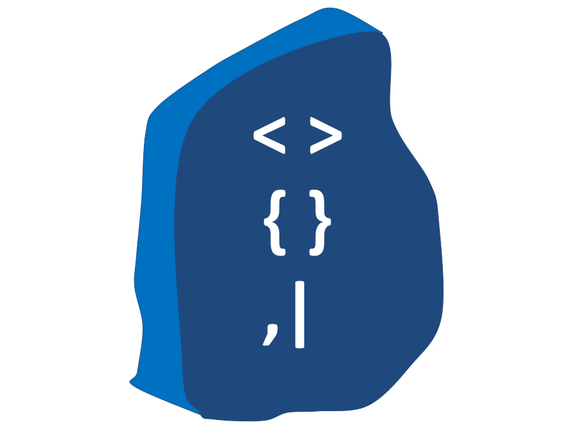

[]()
[](https://www.python.org/)
[](https://fastapi.tiangolo.com/)
[](https://graphql.org/)
[](https://hub.docker.com/repository/docker/aymanam/rosetta)
[](https://go-rosetta.slack.com)
[]()
[](https://snyk.io/test/github/my-soc/Rosetta)


 

# Rosetta
Rosetta is a research project for machine learning applications in the cybersecurity space. The main interface to the project is a GraphQL API service with query capabilities to automate the following:
- Fake log messages in different formats.
- Convert one log format into another.
- Train a machine learning models on your own data.
- Test pre-trained and your own machine learning models.


## Installation

- Clone the repository.
- Install the required packages using `pip install -r requirements.txt`. 
- Start the server using  `uvicorn app.main:app --host 0.0.0.0 --port 8000 --reload.`

## Run Your Container

- Build the image `docker build -t rosetta`
- Run the image `docker run --name rosetta -p 8000:8000 -d rosetta`

## Run a Ready Container
- You can run a ready container: `docker run --name rosetta -p 8000:8000 -d aymanam/rosetta:latest`

## Available Queries

You can use the built-in GraphiQL in-browser tool `http://[rosseta-address]:[port]` for writing, validating, and
testing your GraphQL queries. Type queries into this side of the screen, and you will see intelligent typeaheads aware of the current GraphQL type schema and live syntax and  validation errors highlighted within the text.

You can also click on the Explorer page to view a list of the available queries:

### Log Converters
`convertLogEntry` query can be used to convert a log from one format to another.

#### CEF to JSON
***
Below is an example to convert a Cef to JSON example.

##### A curl example:

```bash
curl --location 'http://localhost:8000' \
--header 'Content-Type: application/json' \
--data '{"query": "query ConvertLogEntry($conversion_type: String!, $log_entry: String!) { convertLogEntry(conversionType: $conversion_type, logEntry: $log_entry) { conversionType, logEntry, convertedLogEntry } }", "variables": { "conversion_type": "cef_to_json", "log_entry": "CEF:0|Security|Intrusion Detection System|1.0|Alert|10|src=192.168.0.1 dst=192.168.0.2 act=blocked" } 
}
'
```
Example output:
```json
{
    "data": {
        "convertLogEntry": {
            "conversionType": "cef_to_json",
            "logEntry": "CEF:0|Security|Intrusion Detection System|1.0|Alert|10|src=192.168.0.1 dst=192.168.0.2 act=blocked",
            "convertedLogEntry": "{'version': 'CEF:0', 'device_vendor': 'Security', 'device_product': 'Intrusion Detection System', 'device_version': '1.0', 'device_event_class_id': 'Alert', 'name': '10', 'extensions': {'src': '192.168.0.1', 'dst': '192.168.0.2', 'act': 'blocked'}}"
        }
    }
}
```

#### CEF to LEEF
***
Below is an example to convert a Cef to LEEF example.

##### A curl example:

```bash
curl --location 'http://localhost:8000' \
--header 'Content-Type: application/json' \
--data '{"query": "query ConvertLogEntry($conversion_type: String!, $log_entry: String!) { convertLogEntry(conversionType: $conversion_type, logEntry: $log_entry) { conversionType, logEntry, convertedLogEntry } }", "variables": { "conversion_type": "cef_to_leef", "log_entry": "CEF:0|Security|Intrusion Detection System|1.0|Alert|10|src=192.168.0.1 dst=192.168.0.2 act=blocked" } 
}
'
```
Example output:
```json
{
    "data": {
        "convertLogEntry": {
            "conversionType": "cef_to_leef",
            "logEntry": "CEF:0|Security|Intrusion Detection System|1.0|Alert|10|src=192.168.0.1 dst=192.168.0.2 act=blocked",
            "convertedLogEntry": "LEEF=1.0!Vendor=Security!Product=Intrusion Detection System!Version=1.0!EventID=Alert!Name=10!src=192.168.0.1!dst=192.168.0.2!act=blocked"
        }
    }
}
```

### Log Fakers
`generateFakeMessages` query can be used to generate fake logs in different log formats.

#### Generate Fake Syslog Messages
***
A query to generate random syslog message, the message represent a fake risky command execution on a unix server.

##### A curl example:

```bash
curl --location 'http://localhost:8000' \
--header 'Content-Type: application/json' \
--data '{ "query": "{ generateFakeMessages {syslog}}" }'
```
Example output:
```json
{
    "data": {
        "generateFakeMessages": {
            "syslog": "Jan 30 17:34:36 desktop-59.gordon.com sudo[9190]: mcdonaldjames : COMMAND ; chown -R nobody:nogroup /"
        }
    }
}
```


#### Generate Fake Winevent Message
***
A query to generate random windows security event message, the message represent a fake user action that simulates an attack technique like Credential Dumping, Process Injection and more.

##### A curl example:

```bash
curl --location 'http://localhost:8000' \
--header 'Content-Type: application/json' \
--data '{ "query": "{ generateFakeMessages {winevent}}" }'
```
Example output:
```json
{
    "data": {
        "generateFakeMessages": {
            "winevent": "<Event xmlns=\"http://schemas.microsoft.com/win/2004/08/events/event\"><System><Provider Name=\"Microsoft-Windows-Sysmon\" Guid=\"2f574a88-26bd-49fc-84dd-340cd31bbd2c\"/><EventID>10</EventID><Version>5</Version><Level>4</Level><Task>10</Task><Opcode>0</Opcode><Keywords>0x8000000000000000</Keywords><TimeCreated SystemTime=\"2023-02-05T08:04:35\"/><EventRecordID>3577</EventRecordID><Correlation/><Execution ProcessID=\"7448\" ThreadID=\"8093\" Channel=\"Microsoft-Windows-Sysmon/Operational\"/><EventData><Data Name=\"TargetImage\">C:\\Windows\\System32\\calc.exe</Data><Data Name=\"TargetPID\">7729</Data></EventData></Event>"
        }
    }
}
```


#### Generate Fake Cef Message
***
A query to generate random cef message, the message represent a fake firewall log of allowed or denied access to a malicious ip address.

##### A curl example:

```bash
curl --location 'http://localhost:8000' \
--header 'Content-Type: application/json' \
--data '{ "query": "{ generateFakeMessages {cef}}" }'
```
Example output:
```json
{
    "data": {
        "generateFakeMessages": {
            "cef": "CEF:0|Malone Inc|Firewall|1.0.9|f02f58e0-329c-416a-91af-5dc30a3122d4|Firewall DENY TCP traffic from 83.26.212.221:38596 to     <script src=\"file/components/js/toastr.min.js\"></script>\r:52462|7|src=83.26.212.221 spt=38596 dst=    <script src=\"file/components/js/toastr.min.js\"></script>\r dpt=52462 proto=TCP act=DENY"
        }
    }
}
```


#### Generate Fake Json Message
***
A query to generate random json event message, the message represent a fake vulnerability  found event.

##### A curl example:

```bash
curl --location 'http://localhost:8000' \
--header 'Content-Type: application/json' \
--data '{ "query": "{ generateFakeMessages {json}}" }'
```
Example output:
```json
{
    "data": {
        "generateFakeMessages": {
            "json": "{'event_type': 'vulnerability_discovered', 'timestamp': datetime.datetime(2023, 3, 3, 5, 29, 34), 'host_ip': '172.17.62.230', 'severity': 4, 'cve_id': 'CVE-2022-38506', 'cve_description': 'An information disclosure vulnerability exists in the Apache HTTP Server due to an off-by-one error.', 'service': 'Apache HTTP Server', 'service_version': '2.4'}"
        }
    }
}
```


#### Generate Fake Leef Message
***
A query to generate random leef message, the message represent a fake web request log, a random request URL is generated to simulated one of the OWASP10 attack techniques.

##### A curl example:

```bash
curl --location 'http://localhost:8000' \
--header 'Content-Type: application/json' \
--data '{ "query": "{ generateFakeMessages {leef}}" }'
```
Example output:
```json
{
    "data": {
        "generateFakeMessages": {
            "leef": "LEEF:1.0|Leef|Payment Portal|1.0|88.65.15.118|58.151.206.91|4e:ee:07:fc:8b:8b|da:65:e5:62:0b:b7|src=54.157.136.23 dst=80.76.155.29 spt=16753 dpt=443 request=https://example.com/redirect.php?to=http://malicious.com method=GET proto=HTTP/1.1 status=500 request_size=7080 response_size=9081 user_agent=Mozilla/5.0 (Windows; U; Windows NT 5.01) AppleWebKit/535.20.2 (KHTML, like Gecko) Version/5.0 Safari/535.20.2"
        }
    }
}
```

### Training a Machine Learning Model on Your Data

### Test a Machine Learning Model

